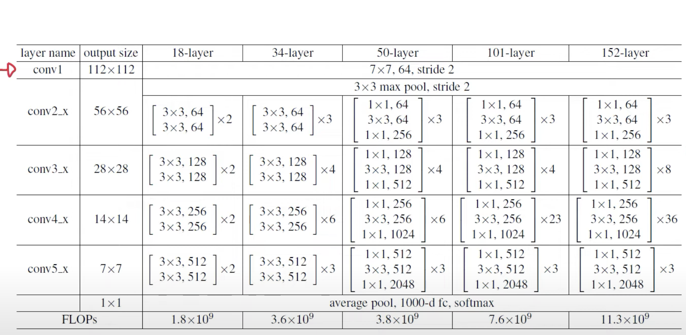

# ResNet (Residual Network) Implementation (ResNet-50)

## What is ResNet?
ResNet (Residual Network) is a deep learning architecture that allows very deep neural networks to train efficiently without vanishing gradients. ResNet solves this problem using **skip connections** (residual connections), which bypass some layers by adding the input of a layer directly to its output. This creates a shortcut in the network, making deep training feasible.

### **Vanishing Gradient Problem**
In deep neural networks, during backpropagation, gradients become very small in the early layers, causing them to update very slowly or not at all. This makes training deep networks difficult.

## **ResNet Achievements**
ResNet won the **ImageNet Large Scale Visual Recognition Challenge (ILSVRC) 2015** in multiple categories:

- **Image Classification** *(1st Place)* - Achieved a top-5 error rate of **3.57%**, surpassing human-level performance (~5%).
- **ImageNet Detection** *(1st Place)* - Used for object detection tasks.
- **ImageNet Localization** *(1st Place)* - Used for precise object localization.
- **COCO Detection** *(1st Place)* - Won in object detection tasks on the COCO dataset.
- **COCO Segmentation** *(1st Place)* - Used in image segmentation tasks.

### **Are Skip Connections Bidirectional?**
Not exactly. In the **forward pass**, they only add previous activations, so they are not truly bidirectional. However, in **backpropagation**, they help maintain strong gradient flow, which feels like bidirectionality since earlier layers receive better updates.

## **How Does ResNet Work?**
Instead of learning a direct mapping \( H(x) \), ResNet learns a **residual function**:

``` H(x) = F(x) + x ```

This ensures gradients don’t vanish, making deep networks trainable.

### **Notes to Consider:**
1. ResNet only learns the necessary change.
2. In ResNet blocks, dimensions remain unchanged unless explicitly modified.

## **ResNet Architecture**


### **ResNet-18 & ResNet-34 (Basic Residual Block)**
- **Architecture:** Uses basic residual blocks.
- **Block Structure:**
  - Two **3×3** convolutional layers.
  - Skip connection adds input to output.
- **Best for:** Lightweight models, fewer parameters, low computation.

### **ResNet-50, ResNet-101, ResNet-152 (Bottleneck Block)**
- **Architecture:** Uses bottleneck residual blocks.
- **Block Structure:**
  - **1×1 convolution** (reduces dimensions).
  - **3×3 convolution** (extracts features).
  - **1×1 convolution** (restores dimensions).
  - Skip connection adds input to output.
- **Best for:** Deep networks with optimized computation.

---
### **References**
- Original ResNet Paper: [Deep Residual Learning for Image Recognition](https://arxiv.org/abs/1512.03385)
- ResNet in PyTorch: [Official PyTorch Implementation](https://pytorch.org/vision/stable/models.html)
- 
📌 *This implementation is specifically focused on **ResNet-50** for learning and explorartion.* 🚀
